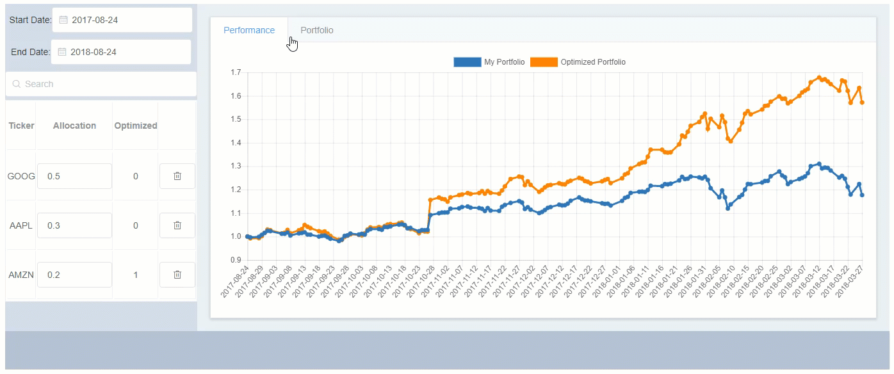

# Stock Portfolio Optimizer: a Vue.js App Example

This web app optimizes your stock portfolio and displays the performance. To define your portfolio, you can select the date range, stock tickers and allocations. A pie chart shows the original stock allocations. The optimized allocations are calculated, the original and optimized portfolio performances are displayed as a line chart. All tables and charts will be updated if any changes are made, e.g., changing date, tickers, allocations. 

This web app uses Vue.js as frontend, Flask as backend. 

## Demo



## Frontend 

### How to run

The frontend is created by running the official tool [Vue CLI 3](https://cli.vuejs.org/) under "app/static/":

```sh
$ vue vue-app
```

To install dependencies, in "app/static/vue-app":

```sh
$ npm install
```

To run for development, in "app/static/vue-app":

```sh
$ npm run serve
```

A frontend dev server with hot-reload will start. You also need to start the backend API server to handle requests. Because we have two servers in this case, requests to the backend API server will cause [CORS](https://developer.mozilla.org/en-US/docs/Web/HTTP/CORS) error. This can be solved by setting [dev server proxy](https://vuejs-templates.github.io/webpack/proxy.html) to the URL of the backend server in `vue.config.js`. 

To test, in "app/static/vue-app":

```sh
$ npm test
```

To compile and minify for production, in "app/static/vue-app":

```sh
$ npm run build
```

After this, you can start the backend server to run the app. 

### The app structure

`vue.config.js`: most of the configurations are set up by the Vue cli during app creation, this file contains additional configurations. Refer to [here](https://cli.vuejs.org/config/) for a complete list of options. 

`src/main.js`: creates the Vue instance, set up plugins. 

`src/App.vue`: the root component. It contains a dashboard on the left and a charting part on the right. 

`src/components/`: the single file components. 

`src/store/`: Vuex's states, mutations and actions. [Vuex](https://vuex.vuejs.org/) is used in here for state management. States contain data that can be shared between components. 

### Other libraries

[Element UI](http://element-cn.eleme.io/#/en-US/) is used for the UI components, e.g., the date picker, the tab pane, etc. 

[vue-chartjs](https://vue-chartjs.org/) is used for chartting. Its reactive props make the charts reactive, i.e., charts will automatically reload when the associated data changes. 


## Backend

### How to run 

The backend is created from this template: 

[Flask-Web-App-Template](https://github.com/PPPW/Flask-Web-App-Template)

To install dependencies:
```sh
$ pip install -r requirements.txt
```

To run:

```sh
$ python manage.py runserver
```

To test:

```sh
$ python manage.py test
```

The server API: 

```
/api/opt : get portfolio performance and optimize. 
/api/ticker : check whether a ticker exist.
/api/autocomplete : autocomplete a ticker using S&P 500 (2017) tickers.
/api/test : for testing the API
```

If any other URLs are requested, the server will check whether the files exist, if so, it will serve the requested files. Otherwise, it will redirect to the index page (i.e., `static/vue-app/dist/index.html`, the built result of the frontend). 

### Portfolio optimization

Given a set of tickers and a date range, the optimized portfolio allocations are calculated by maximizing the Sharp ratio. `scipy.optimize.minimize` is used for optimization. 

The stock data is obtained by `pandas_datareader`, the data source is "quandl" ("yahoo" and "google" not working now). 
